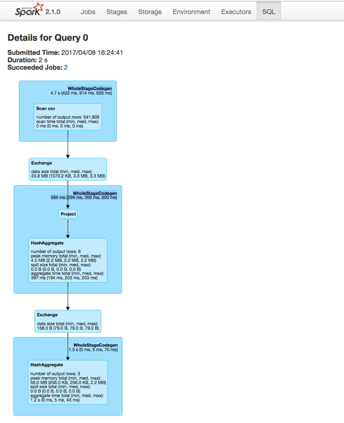
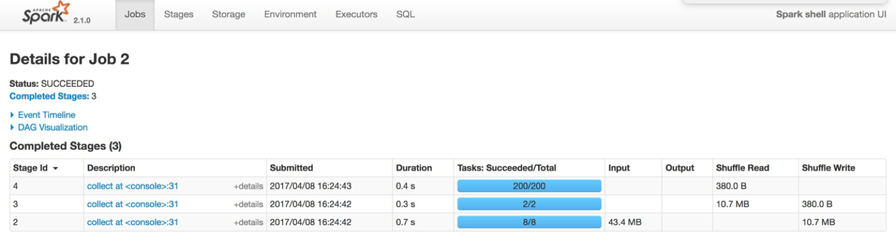
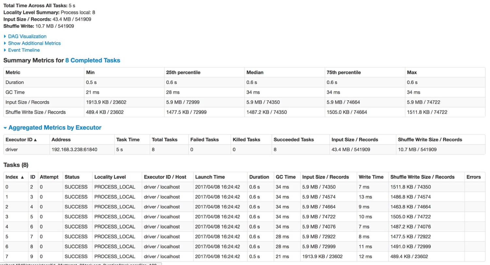

# Chapter 18. 모니터링과 디버깅

- 스파크 잡 생애주기를 추적하는 방법
- 스파크 UI, REST API, 히스토리 서버
- 디버깅 및 응급 처치

---

## 모니터링 범위
- 스파크 애플리케이션과 잡
  - 애플리케이션의 실행 상황 파악 및 디버깅 용도
  - 도구 : 스파크 UI와 스파크 로그 확인 : RDD와 쿼리 실행 계획 같은 개념적 수준 정보 제공
- JVM
  - 익스큐터, 드라이버
  - 도구 : jstack(스택 트레이스), jmap(힙덤프), jstat(시계열 통계 리포트), jconsole/jvisualvm(JVM속성 시각화)
- OS, 머신
  - CPU, 네트워크, I/O 등이 자원 모니터링
  - 도구 : dstat, iostat, iotop
- 클러스터
  - YARN, 메소스, 스탠드얼론, 쿠버네티스
  - 도구 : Ganglia, Prometheus


## 모니터링 대상
- 실행 중인 사용자 애플리케이션의 프로세스 : CPU, 메모리
- 프로세스 내부에서의 쿼리 실행 과정 : 잡, 태스크
  
### - 드라이버와 익스큐터 프로세스
- 드라이버 유심히 관찰해야 함. 모든 애플리케이션의 상태가 보관.
- 익스큐터 상태 파악도 중요.
- 드롭위자드 메트릭 라이브러리 기반의 메트릭 시스템
  - conf/metrics.properties 파일을 생성해 설정 가능
  - 설정 파일은 spark.metric.conf 를 통해 변경 가능
- 참고
  https://github.com/apache/spark/blob/master/conf/metrics.properties.template

### - 쿼리, 잡, 스테이지, 태스크
- 클러스터에서 특정 시점에 실행되는 작업을 파악 가능
- 성능 개선, 디버깅시 유용함

## 스파크 로그
- 애플리케이션 로그 / 스파크 자체 로그
- 설정
  - conf/log4j.properties
  - spark.sparkContext.setLogLevel("INFO")


## 스파크 UI

### - 클러스터 매니저 UI
  - 스탠드얼론 마스터 (8080)
  
  - YARN 리소스매니저 (8088)
  
### - 애플리케이션 UI
  - 기본 4040으로 실행. 중복될 경우 1씩 증가시켜서 실행 시도
  
  
  - 메뉴
    - Jobs : 잡 정보
    - Stages : 개별 스테이지 (태스크) 정보
    - Storage : 캐시된 RDD, DataFrame정보를 제공
    - Environment : 클러스터에 설정된 다양한 스파크 속성, 스칼라, 자바 관련 런타임 환경 정보 제공
    - Executors : 익스큐터의 상세 정보 제공
    - SQL : SQL과 DataFrame을 포함한 구조적 API 쿼리 정보 제공
  
  - SQL 탭
      >  https://databricks-prod-cloudfront.cloud.databricks.com/public/4027ec902e239c93eaaa8714f173bcfc/7198785880357665/128598666827103/4008806447479720/latest.html
      
      > https://community.cloud.databricks.com/?o=7198785880357665#setting/sparkui/0424-100127-quip616/driver-595780343943552237
      

    
  
  - Jobs 탭
    
  
  - 태스크 정보
    

### - REST API
- REST API 형태로 상태와 메트릭 확인 가능
- 대부분 UI 에서 확인 가능한 정보
- SQL 관련 정보는 제공하지 않음 (DAG)
- http://localhost:4040/api/v1

### - 히스토리 서버 
- 종료된 애플리케이션 정보를 확인 하기 위해 히스토리 서버를 이용 가능
- 사전에 이벤트 로그를 남겨야 함. 저장된 로그를 기준으로 히스토리 서버 실행
  ```bash
  spark.eventLog.enabled = true
  spark.eventLog.dir = hdfs://namenode:8020/log
  ```

## 디버깅 및 스파크 응급 처치

### - 스파크 애플리케이션, "시작되지 않은" 경우
 - 증상 : 잡실행 안됨. 스파크 UI 정보 이상
 - 원인 : 설정 이슈, 네트워크 이슈, 유휴 자원 이상 요구
 - 대응 : 설정 확인, 자원 확인

### - 스파크 애플리케이션, "실행 전"에 오류가 발생한 경우
- 증상 : 실행시 오류, 스파크 UI 정보 확인 안됨
- 원인 : 오타. 네트워크 이슈
- 대응 : 스파크UI ENV확인. 클래스패스 확인

### - 스파크 애플리케이션, "실행 중"에 오류가 발생한 경우
- 증상 : 특정 단계 실패, 되던게 안됨
- 원인 : 데이터 없음. 포맷 변경. null
- 대응 : 데이터 확인, 스택트레이스 분석

### - 느리거나 뒤처진 "태스크"
- 증상 :
    - 일부 태스크만 오래 걸림
    - 동일 데이터에 대해 항상 오류 발생
    - 머신 수 늘려도 동일.
    - 특정 익스큐터에서만 작업이 일어남
- 원인 :
    - 데이터 치우침. 느린 태스크 (낙오자)는 특정 키에 데이터 몰릴 때 발생됨
    - 특정 머신 성능 나쁨
    - 집계 연산은 공통 키와 관련된 많은 데이터를 메모리에 적재. 걍 느림
    -  Dataset은 UDF의 자바 객체로 변환하기 위해 수많은 객체 생성 => 잦은 GC 
- 대응 :
    - 파티션 수 증가
    - 다른 컬럼 활용해 파티션 분배
    - 익스큐터 메모리 증가

### - 느린 "집계" 속도
- 증상 : groupBy 호출시 느린 태스크, 집계 처리 이후 잡이 느려짐
- 원인 :
    - 데이터가 특정 키에 치우침
    - 스파크는 null 값을 건너뛰기 위한 최적화 수행. null 대신 " ", "EMPTY" 같은 대체 값 있으면 최적화 불가
- 대응 : 
    - 집계 연산 전 파티션 수 증가
    - 익스큐터 메모리 증가 => 디스크에 저장하는 빈도 줄임
    - repartition

### - 느린 "조인" 속도
- 증상 : 조인 스테이지 느림. 조인 전후 정상 동작
- 원인 :
    - 
- 대응 :
    - 조인 타입 변경
    - 조인 순서 변경. 조인 전에 셀렉트
    - null 대체값 확인
    - 자동 브로드캐스트 조인을 위해서는 실행 계획 생성해야 함.
      ```sql
      ANALYZE TABLE [dbname.]table_name COMPUTE STATISTICS [OPTION]
      ```

### - 느린 "I/O" 속도
- 증상 : 분산 파일 시스템, 외부 시스템의 읽는 속도 느림, 네트워크 파일 시스템, blob 저장소 쓰는 속도 느림
- 원인 : 스파크와 저장소간 네트워크 대역폭
- 대응 : 
    - spark.speculation=true 를 이용해 개선 가능. <br>
      첫번 째 태스크에서 발생한 문제가 일시적인지 확인하기 위해 동일한 연산을 수행하는 태스크를 추가로 실행
    - locality-aware scheduling. 스파크와 HDFS가 같은 클러스터라면, 동일한 호스트명을 인식하는지 확인.

### - 드라이버, OOM
- 증상 : 무응답, 미정상 종료. 로그에 OOM
- 원인 : 
    - collect
    - 브로드캐스트 조인하기에 사이즈 클때
    - 객체 해제 못해서
    - 파이썬과 같은 다른 언어 함께 사용시, 데이터 변환에 많은 메모리 사용
    - 여러 사용자가 SparkContext 공유시
- 대응 :
    - jmap 으로 힙 메모리 히스토그램 확인 
    - 드라이버 메모리 증가
    - 드라이버로 데이터 모으지 않기. 파일 활용 등

### - 익스큐터, OOM
- 증상 : executor 비정상 종료. 특정 노드 느린 태스크 복구 안됨
- 원인 :
    - 태스크에 너무 많은 객체 생성. UDF 사용시 그럴 수 있음
- 대응 :
    - 익스큐터 수 증가
    - 리파티션
    - null 대체 값 확인
    - RDD, Dataset은 객체를 생성하기 때문에 구조적 API 사용 추천
    - UDF 적게 사용하길 추천
    - jmap 으로 가장 많은 메모리 사용 클래스 확인

### - 의도하지 않은 null 값이 있는 결과 데이터
- 증상 : 트랜스포메이션 결과에 null, 되던게 안됨
- 원인 : 데이터 포맷 변경. 
- 대응 :
    - 어큐뮬레이터를 사용해 레코드나 특정 데이터 타입 수 확인. 비정상 레코드에 대해 건너뛰는 오류 분석 가능
    - 쿼리 실행 계획 확인
    - 5* "23" => 115
    - 5 * " " => null

### - 디스크 공간 없음 오류
- 증상 : no space left on disk
- 원인 : 데이터 치우침, 스파크 로그
- 대응 : 디스크 추가 확보, 외부 저장소 사용, 리파티션, 로그 파일 제거, 셔플 파일 제거

### - 직렬화 오류
- 증상 : 직렬화 오류로 잡 실패
- 원인 : 구조적API에서는 거의 발생 안함. UDF나 RDD 사용시 발생
- 대응 : 자바나 스칼라 클래스에서 UDF 생성시 인클로징 객체의 필드 사용하면 안됨
